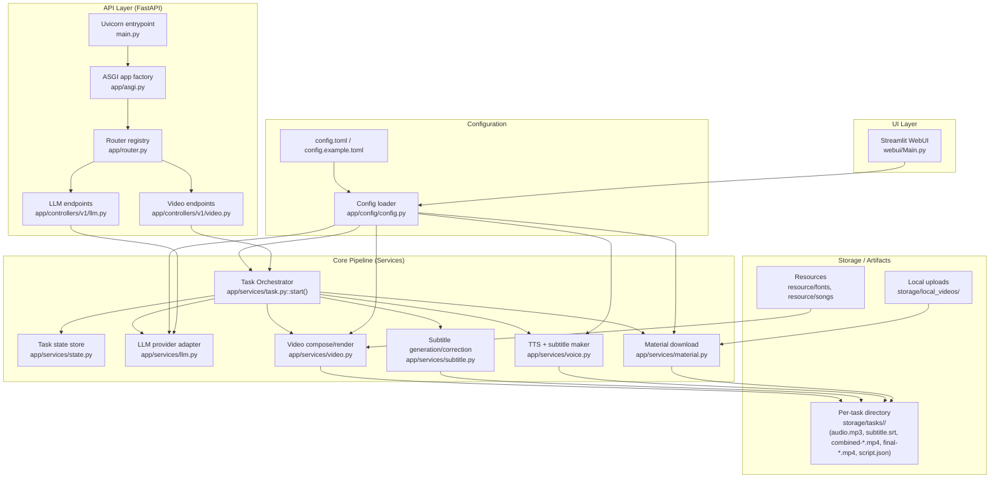
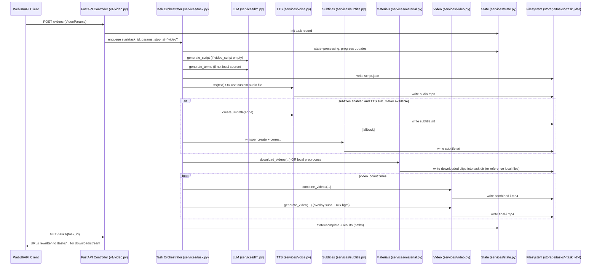

# CODEMAP

This document provides a diagram-style codemap and a “read first” guide for the repository.

## System overview (UI/API → task pipeline → artifacts)

## Detailed pipeline (what `task.start()` does)

## Most important files to read first (in order)

- **README.md / README-en.md**
  - How to run WebUI + API, required dependencies, expected behavior.
- **main.py**
  - API server entrypoint (Uvicorn) → `app.asgi:app`.
- **app/asgi.py**
  - FastAPI app creation, middleware, static mounts.
- **app/router.py**
  - Router registry (what endpoints are exposed).
- **app/controllers/v1/video.py**
  - Task creation, query/delete, uploads, streaming/downloading.
- **app/services/task.py**
  - Authoritative end-to-end pipeline orchestration (`start()`).
- **app/models/schema.py**
  - `VideoParams` (core config object) and enums.
- **app/services/video.py**
  - Video composition/rendering.
- **app/services/voice.py**
  - TTS provider integrations + subtitle creation helpers.
- **app/services/material.py**
  - Stock video search/download logic.
- **app/config/config.py + config.example.toml**
  - Config keys and defaults.
- **webui/Main.py**
  - Streamlit UI wiring.
